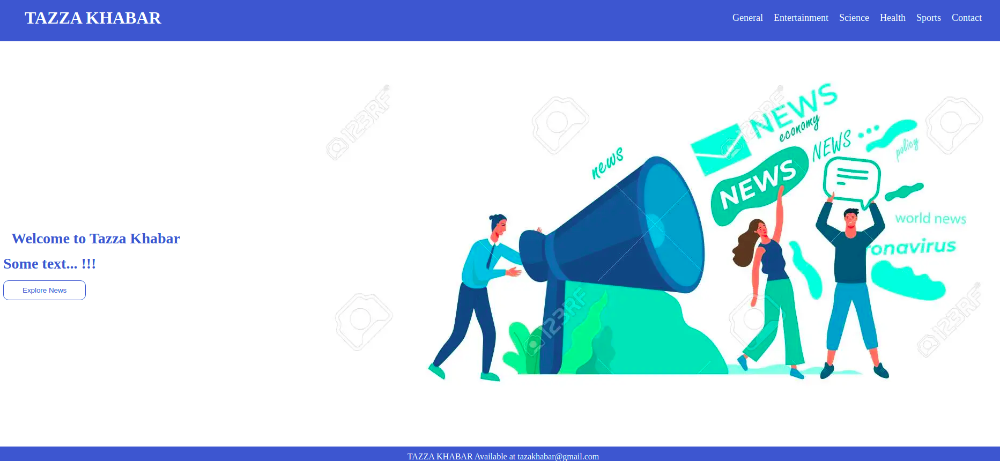
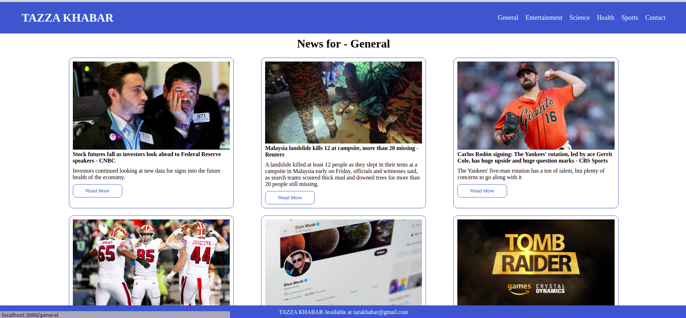
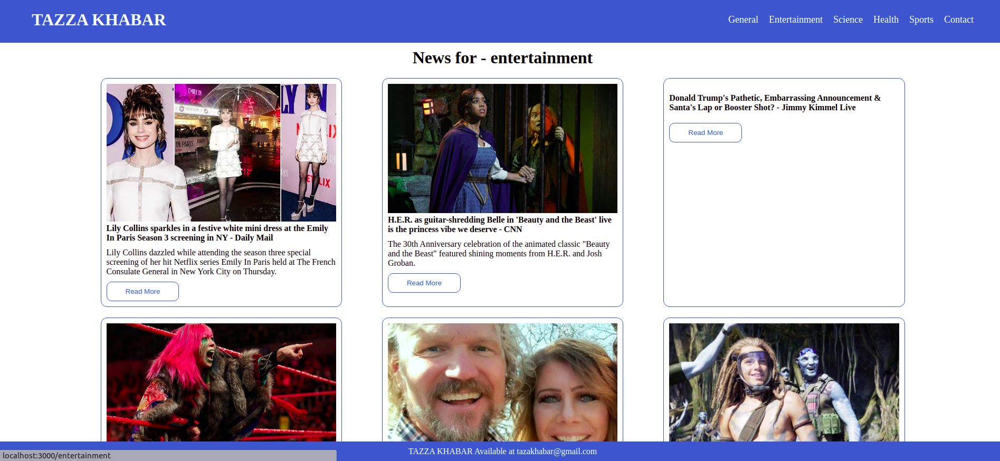
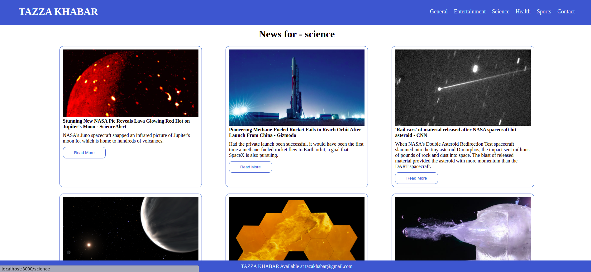
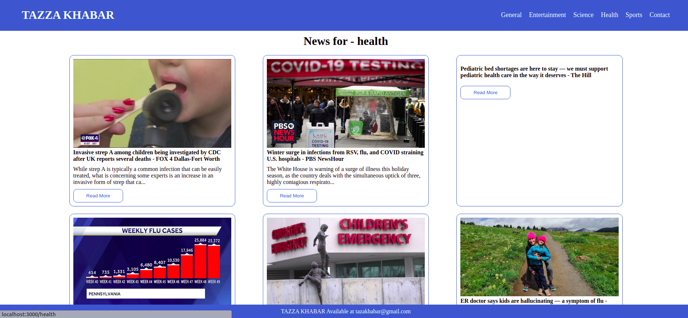
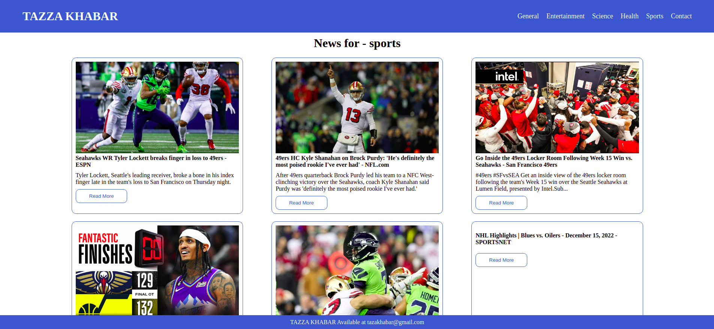

# News Application Clone by REACT

Hiee!! **Alfiyabanu Bhojani** here...

This is React **News Application clone**...

What is done in this Clone:-

- Build Front page of News App
- Build the General Page of News App
- Build the Entertaiment Page of News App
- Build the Science Page of News App
- Build the Health Page of News App
- Build the Sports Page of News App
- Build the Contact Page of News App

In this Clone,

There are different type of page...
Every page has different type of news based on there respective topic... There is a opinion of READ MORE for the news to read the news in details..
In Contact page there is form for the Contact of user..

This Clone is made up of functional Component as well as Class Based Component..

**Tech used**

- **React**

Output Image:-

1. Banner Image/ Front page Image
   

2. General Page Image
   

3. Entertainment Page Image
   

4. Science Page Image
   

5. Health Page Image
   

6. Sports Page Image
   

7. Contact Page Image
   
